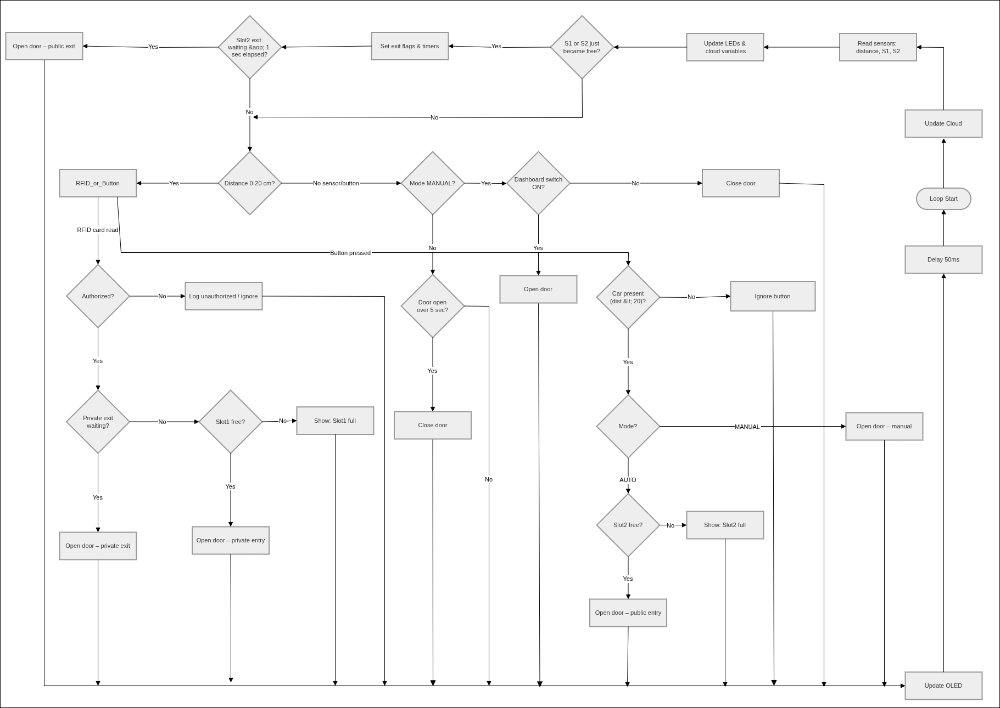
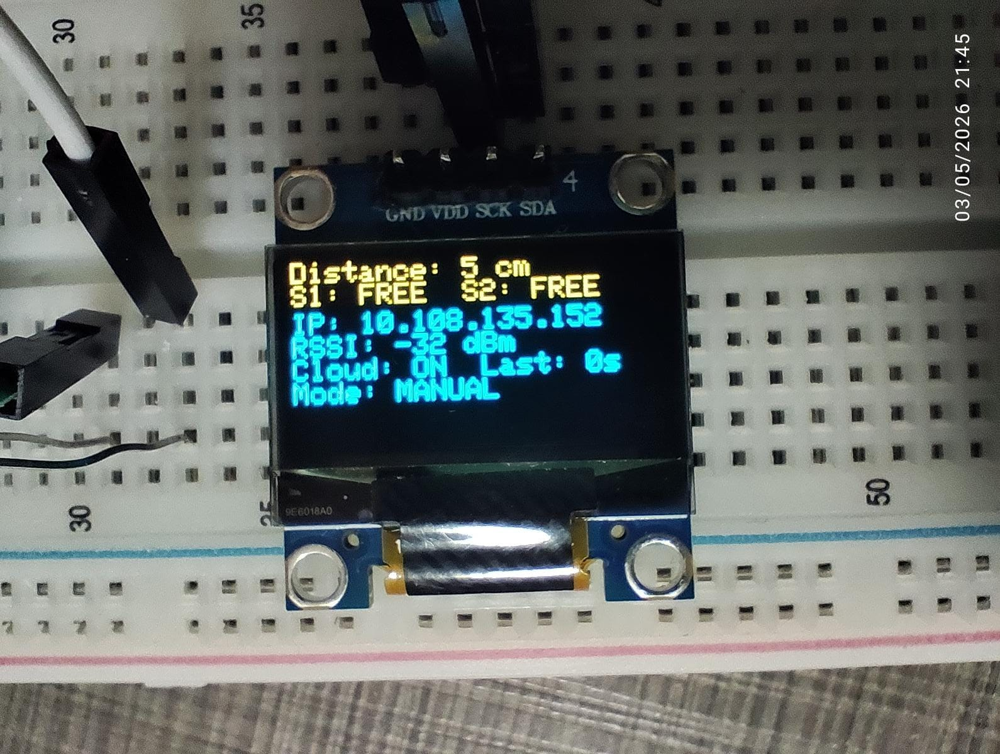
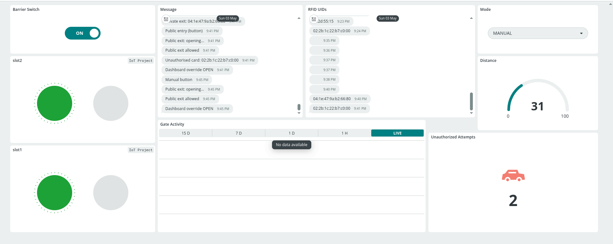

# Smart Parking Barrier System

## 1. Project Summary
In small apartment buildings, finding a parking spot can be hard, and checking cars by hand takes a lot of time. This project solves that problem with a smart parking barrier using an ESP32. When a car arrives, an HC-SR04 distance sensor notices it. Car owners scan their RFID cards, and if the card is valid, a small SG-90 servo motor opens the gate. Inside the parking area, two IR sensors and LEDs show if the parking spots are free or full. There is also a small OLED screen on the gate to show live information. Everything is connected to the Arduino IoT Cloud. You can check parking spots or open the gate for visitors from a web page, even if they don’t have a card.

## 2. List of Parts

* **Microcontroller:** ESP32
* **Sensors:**
  * HC-SR04 (ultrasonic distance sensor)
  * RC522 (RFID reader)
  * 2x IR Obstacle Sensors (FC-51)
* **Display:** 0.96-inch I2C OLED (128x64)
* **Other Parts:**
  * SG-90 Servo Motor (opens the gate)
  * 2x LEDs (show if spots are free or full)
* **Button:** For opening the gate by hand or letting visitors in

## 3. Wiring Table & Diagram   Note: Tables are inorder at github page, look at file for better view

| Component         | ESP32 Pin | Note                     |
| :---------------- | :-------- | :----------------------- |
| **RC522 SDA (SS)**| GPIO 5    | SPI                      |
| **RC522 RST**     | GPIO 4    | Reset                    |
| **Servo Motor**   | GPIO 26   | PWM Signal               |
| **HC-SR04 Trig**  | GPIO 13   | Trigger                  |
| **HC-SR04 Echo**  | GPIO 12   | Echo                     |
| **IR Sensor 1**   | GPIO 27   | Slot 1 Status            |
| **IR Sensor 2**   | GPIO 14   | Slot 2 Status            |
| **Button**        | GPIO 33   | Exit / Visitor trigger   |
| **Slot 1 LED**    | GPIO 32   | Status light             |
| **Slot 2 LED**    | GPIO 25   | Status light             |

> **Note:** all the ground (GND) wires should be connected together.

### Wiring Diagram

## 4. Cloud Setup
**Arduino IoT Cloud** can be used to monitor and control the parking barrier system. To make it work, you need to create these variables in your dashboard:

| Variable Name           | Type     | Permission | Purpose |
| :---------------------- | :------- | :--------- | :----------------------------- |
| `distance`              | `float`  | Read Only  | Car distance at the gate |
| `slot1`                 | `bool`   | Read Only  | Slot 1 status (true = full) |
| `slot2`                 | `bool`   | Read Only  | Slot 2 status (true = full) |
| `rfid_uid`              | `String` | Read Only  | Last scanned card ID |
| `message`               | `String` | Read Only  | System messages |
| `mode`                  | `String` | Read & Write | "AUTO" or "MANUAL" |
| `barrier_switch`        | `bool`   | Read & Write | Button to open gate manually |
| `gate_activity`         | `int`    | Read Only  | Used for the chart |
| `unauthorized_attempts` | `int`    | Read Only  | Counts bad card scans |

## 5. How to Run

1. Open Arduino IDE and make sure you have the ESP32 board installed.
2. Install these libraries:
   * MFRC522
   * ESP32Servo
   * Adafruit GFX Library
   * Adafruit SSD1306
3. Go to Arduino IoT Cloud and set up your variables as in the table.
4. Enter your Wi-Fi name and password in the code.
5. Upload the code to your ESP32 board.
6. Open your cloud dashboard – you are ready!

## 6. How It Works
The system has two modes: **AUTO** and **MANUAL**.

**AUTO Mode:**
* The HC-SR04 sensor looks for cars. If a car is close (less than 20 cm), the system waits for an RFID card.
* If the right card is scanned and a parking spot is free, the gate opens with the servo and closes again after 5 seconds.
* IR sensors check if the spots are full. If a car parks, the LED turns on and the dashboard updates.

**MANUAL Mode:**
* If you switch to MANUAL mode on the website, the sensors and card reader stop working.
* You can open or close the gate with the `barrier_switch` on the dashboard. This is useful for visitors.

**Local Display:** The OLED screen on the gate shows:
* Car distance
* If spots are free or full
* Your Wi-Fi IP address
* If the cloud is connected
* AUTO or MANUAL mode

## 7. Evidence

### OLED Screen
Here’s how the OLED screen looks when you are watching the system live:

### Cloud Dashboard
Here is the view of the Arduino IoT Cloud Dashboard:

### Project Demo

Below you can see recording of the model and the cloud dashboard working together in real time:
<table style="width:100%">
  <tr>
    <th style="text-align:center">Physical Model Action & Cloud Dashboard Sync</th>
  </tr>
  <tr>
    <td></td>
  </tr>
</table>