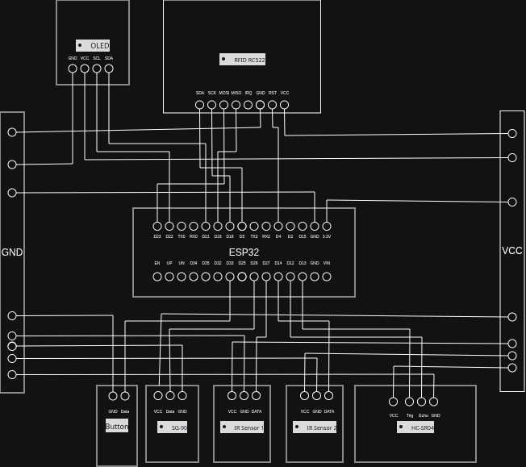

# Smart Parking Barrier System

## 1. Project Summary
In small apartment buildings, finding a parking spot is hard and manual security checks are slow. This project fixes this with a smart barrier system using an ESP32.  When a car arrives, an HC-SR04 distance sensor sees it. Owners scan an RFID card, and if it is valid, an SG-90 servo motor opens the gate. Inside, two IR sensors and LEDs show if the parking spots are free or full. A small OLED screen on the gate displays live information.  Everything connects to the Arduino IoT Cloud. From a web page, an operator can monitor the parking spots or easily open the gate for visitors without a card.  

## 2. Components List
* **Microcontroller:** ESP32
* **Sensors:** 
  * HC-SR04 (Ultrasonic distance sensor)
  * RC522 (RFID Reader)
  * 2x IR Obstacle Sensors (FC-51)
* **Display:** 0.96-inch I2C OLED (128x64)
* **Actuators & Outputs:** 
  * SG-90 Servo Motor (opens the gate)
  * 2x LEDs (Slot indicators)
* **Input:** Push Button (for manual exit or visitor entry)

## 3. Wiring Table & Diagram

| Component         | ESP32 Pin | Note                     |
| :--- --- --- ---  | :--- --- -| :--- --- --- --- --- --- |
| **RC522 SDA (SS)**| GPIO 5    | SPI                      |
| **RC522 RST**     | GPIO 4    | Reset                    |
| **Servo Motor**   | GPIO 26   | PWM Signal               |
| **HC-SR04 Trig**  | GPIO 13   | Trigger                  |
| **HC-SR04 Echo**  | GPIO 12   | Echo                     |
| **IR Sensor 1**   | GPIO 27   | Slot 1 Status            |
| **IR Sensor 2**   | GPIO 14   | Slot 2 Status            |
| **Button**        | GPIO 33   | Exit / Visitor trigger   |
| **Slot 1 LED**    | GPIO 32   | Status light             |
| **Slot 2 LED**    | GPIO 25   | Status light             |

> **Note:** Make sure to connect all the ground (GND) wires together.

### Wiring Diagram

## 4. Cloud Setup
This project uses **Arduino IoT Cloud**. To make it work, you need to create these variables in your dashboard:

| Variable Name           | Type     | Permission | Purpose |
| :--- --- ---            | :--- ----| :--- --- --- --- --- --- |
| `distance`              | `float`  | Read Only  | Car distance at the gate |
| `slot1`                 | `bool`   | Read Only  | Slot 1 status (true = full) |
| `slot2`                 | `bool`   | Read Only  | Slot 2 status (true = full) |
| `rfid_uid`              | `String` | Read Only  | Last scanned card ID |
| `message`               | `String` | Read Only  | System messages |
| `mode`                  | `String` | Read & Write | "AUTO" or "MANUAL" |
| `barrier_switch`        | `bool`   | Read & Write | Button to open gate manually |
| `gate_activity`         | `int`    | Read Only  | Used for the chart |
| `unauthorized_attempts` | `int`    | Read Only  | Counts bad card scans |

### Dashboard Widgets
Add these widgets to your Arduino Cloud dashboard to monitor everything:

1.  **Gauge:** Link to `distance` to see how close a car is.
2.  **LEDs (x2):** Link to `slot1` and `slot2` to see if parking spots are taken.
3.  **Value:** Link to `rfid_uid` and `message` to read system info.
4.  **Value:** Link to `mode` so you can type "AUTO" or "MANUAL" to change it.
5.  **Switch:** Link to `barrier_switch` to open the gate yourself.
6.  **Value:** Link to `unauthorized_attempts` to see if someone tried a fake card.
7.  **Chart:** Link to `gate_activity` to see a graph of when the gate opened.

## 5. How to Run
1.  Open the Arduino IDE and make sure you have the ESP32 board installed.
2.  Install these libraries:
    *   `MFRC522`
    *   `ESP32Servo`
    *   `Adafruit GFX Library`
    *   `Adafruit SSD1306`
3.  Go to **Arduino IoT Cloud** and set up your variables just like the table above.
4.  Put in your Wi-Fi name and password.
5.  Upload the code to your ESP32 board.
6.  Open your cloud dashboard and you are ready to go!

## 6. How it Works
The system can run in two different ways: **AUTO** or **MANUAL**.

- **AUTO Mode:**
    - The HC-SR04 sensor looks for cars. If a car is closer than 20 cm, the system waits for an RFID card.
    - If you scan the correct card and a parking spot is free, the servo motor opens the gate. It closes by itself after 5 seconds.
    - The IR sensors watch the parking spots. If a car parks, the LED turns on and the dashboard updates.
- **MANUAL Mode:**
    - If you change the mode to MANUAL on the website, the sensors and RFID reader stop opening the gate.
    - You can use the `barrier_switch` on the dashboard to open or close the gate. This is great if a visitor comes and doesn't have a card.
- **Local Display:** The OLED screen on the gate shows lots of info:
    - Car distance
    - If the slots are empty or full
    - Your Wi-Fi IP address
    - If the cloud is connected
    - If it is in AUTO or MANUAL mode

## 7. Evidence

### Dashboard Interface
Here is what the Arduino IoT Cloud dashboard looks like when monitoring the system:

### Project Demo  : Can take a while to load the GIFs, please wait a moment
I recorded the physical model and the cloud dashboard. You can see how they work together in real-time below:

<table style="width:100%">
  <tr>
    <th style="text-align:center">Physical Model Action & Cloud Dashboard Sync</th>
  </tr>
  <tr>
    <td></td>
  </tr>
</table>
